<p align="right">
  <a href="https://github.com/4ndymcfly/42env">
    
     Spanish version
  </a>
</p>

<p align="center">
  
</p>

<h1 align="center">42 ENVironment Configuration Script</h1>

<p align="center">Automates the installation and configuration of the basic environment to get started in the 42 cursus.</p>

<p align="center">Tested on <a href="https://releases.ubuntu.com/jammy/">Ubuntu 22.04 LTS</a></p>

<br>

<!-- Table of Contents -->
# Table of Contents

1. [Software](#software)
2. [Recommendations](#recommendations)
3. [Installation](#installation)
4. [During Execution](#during-execution)
5. [LazyVim](#lazyvim)
    - [Basic Usage of LazyVim](#basic-usage-of-lazyvim)
    - [Tabs in LazyVim](#tabs-in-lazyvim)
6. [Extras](#extras)
    - [LSD (LSDeluxe)](#lsd-lsdeluxe)
    - [LazyGit](#lazygit)
7. [Kitty Terminal](#kitty-terminal)
    - [Main Keyboard Shortcuts](#main-keyboard-shortcuts)
    - [Example Images](#example-images)
    - [Image and Graphic Support](#image-and-graphic-support)
    - [Tabs](#tabs)
8. [In Progress...](#in-progress)

## Software

This script installs the following software if it is not already installed:

- **LazyVim |** [Neovim setup powered](https://www.lazyvim.org/) + 42 Plugins
- **git |** [Git Fast Version Control](https://git-scm.com/doc)
- **python3 |** [Python 3.10.2](https://docs.python.org/3.10/)
- **pip3 |** [Package Installer for Python](https://pip.pypa.io/en/stable/)
- **zsh |** [ZSH Shell](https://www.zsh.org/)
- **ripgrep |** [Recursively searches by regex pattern](https://github.com/BurntSushi/ripgrep)
- **fd / fd-find |** [Simple alternative to 'find'](https://github.com/sharkdp/fd)
- **luarocks |** [Package manager for Lua modules](https://luarocks.org/)
- **kitty |** [GPU-based terminal emulator](https://sw.kovidgoyal.net/kitty/)
- **nerd fonts |** [Iconic font aggregator, collection, and patcher](https://www.nerdfonts.com/) | Hack Nerd Font
- **lsd |** [The next-gen ls command](https://github.com/lsd-rs/lsd)
- **lazygit |** [Simple terminal UI for git commands](https://github.com/jesseduffield/lazygit)
- Keyboard shortcuts for 'nvim' and config for .zshrc

## Recommendations

**IMPORTANT:** Before starting the process, it is recommended to create a backup or snapshot of your current virtual machine state.
This script is intended for use on your personal computer. I will soon publish a version for limited users with compatibility across a wider range of distributions.

## Installation

<div align="center">
  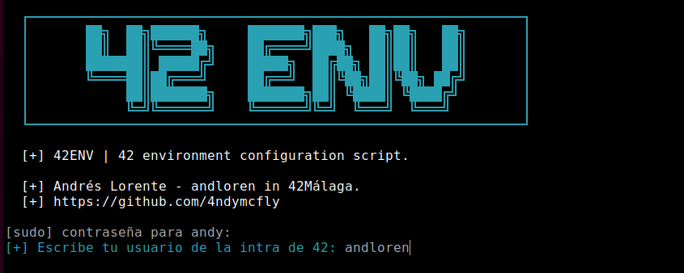
</div>

First, download the repository and navigate to the 42env folder of the cloned repository.
```bash
git clone https://github.com/4ndymcfly/42env.git ; cd 42env
```
Next, grant execute permissions to the script and run it. It is recommended to keep the shell window maximized.
```bash
chmod +x 42env.sh ; ./42env.sh
```
<div align="center">
  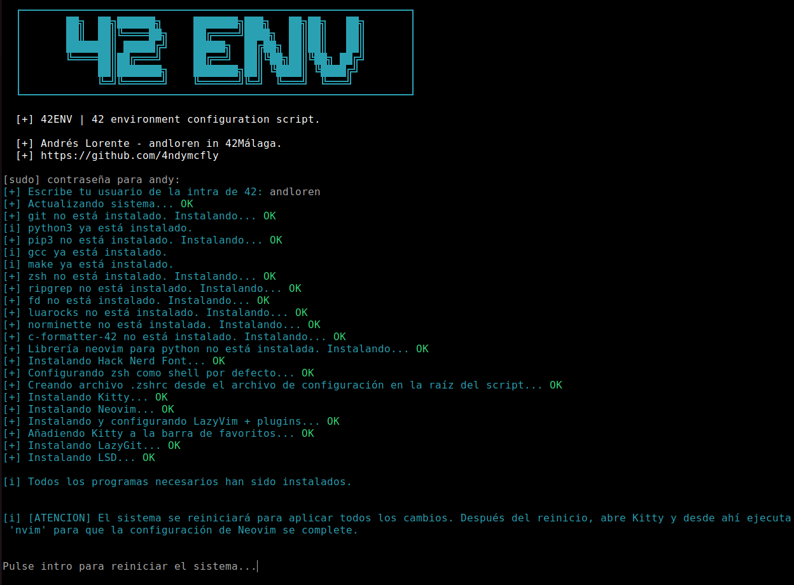
</div>

## During Execution

When running the script, you will be prompted for your intra username; enter it and press Enter. This username will be used to configure the C header.

Once the process is complete, press Enter, and the system will reboot.

After rebooting, click on the new kitty icon, maximize the window, and run nvim.
```bash
nvim
```

If you don't click the installation window, the installer might prompt you to press a key. In that case, press the space key. The configuration will continue and finish when it asks you to press enter.

<div align="center">
  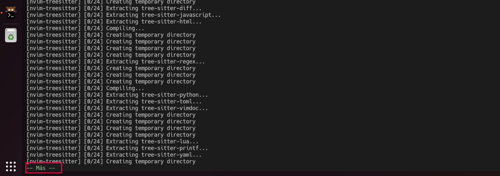
</div>
<br>
<div align="center">
  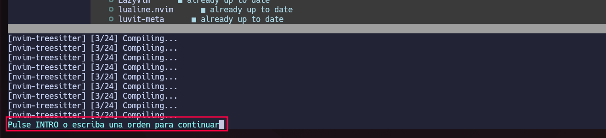
</div>
<br>
Wait a few moments, and LazyVim will be ready and configured to start.

<div align="center">
  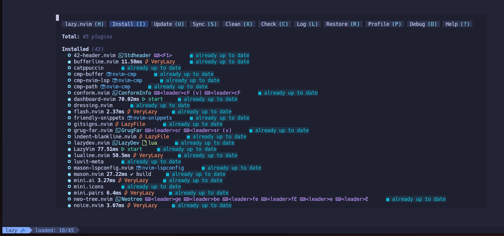
</div>
<br>
Press `F4` to close nvim (keyboard shortcut already configured).

<br>

# LazyVim

If you run nvim without specifying a file name, you will access the LazyVim main menu, allowing you to perform various actions.


## Basic Usage of LazyVim

LazyVim has six main keys defined for daily use that only work in NORMAL mode:

**Key `F1`:** Inserts the 42 header, adds a line break, and switches the editor to Insert mode.

<div align="center">
  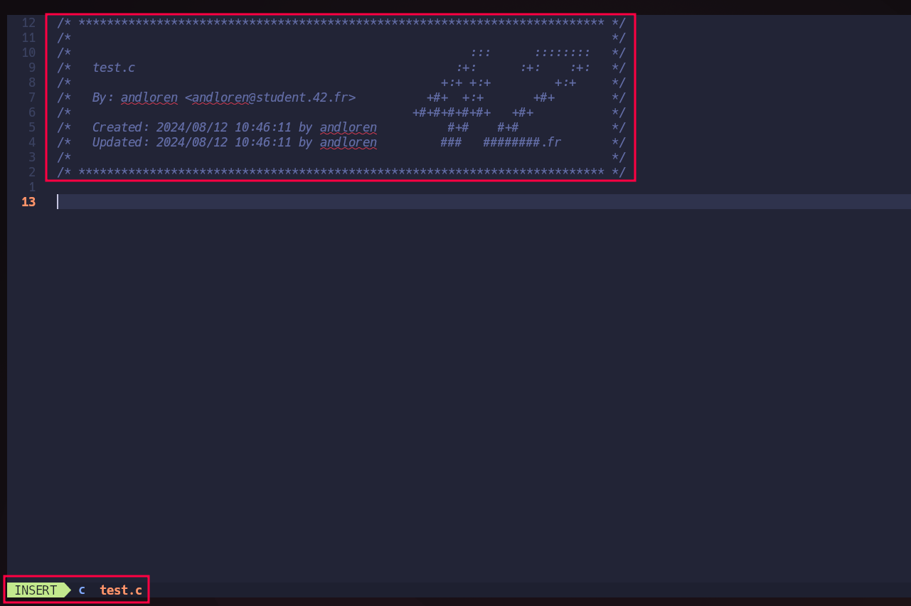
</div>

<br>

**Key `F2`:** Formats the code for norminette.

<div align="center">
  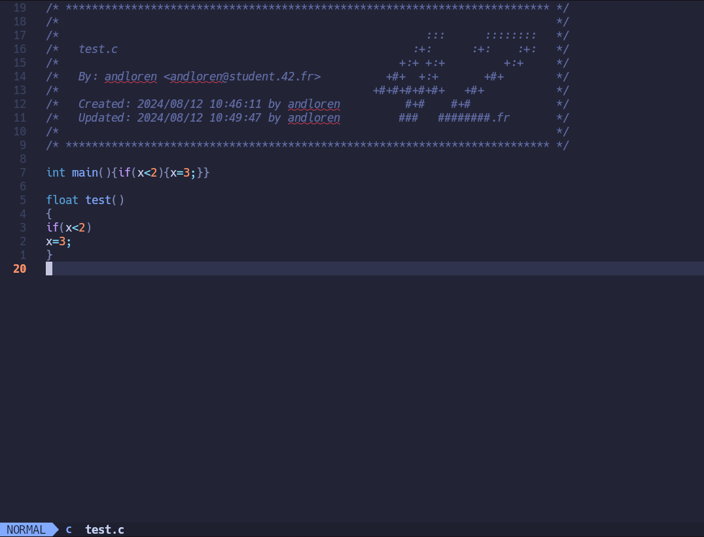
  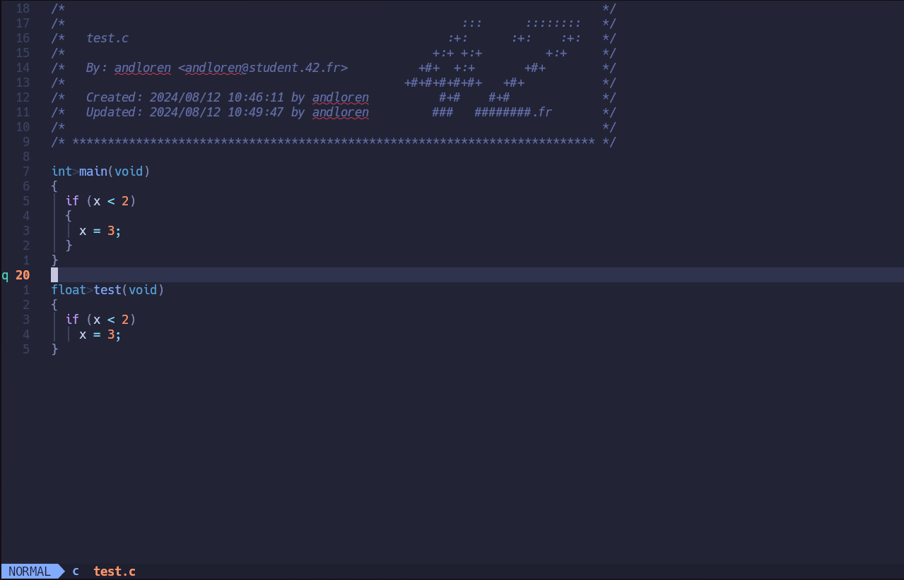
</div>

<br>

**Key `F3`:** Runs norminette with the -R CheckForbiddenSourceHeader flags.

<div align="center">
  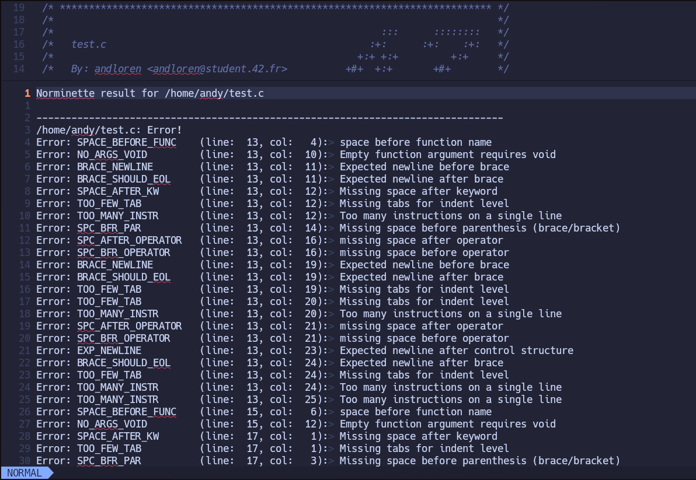
</div>

<br>

**Key `F4`:** Closes the active window / norminette / Closes nvim / Equivalent to :q.

<div align="center">
  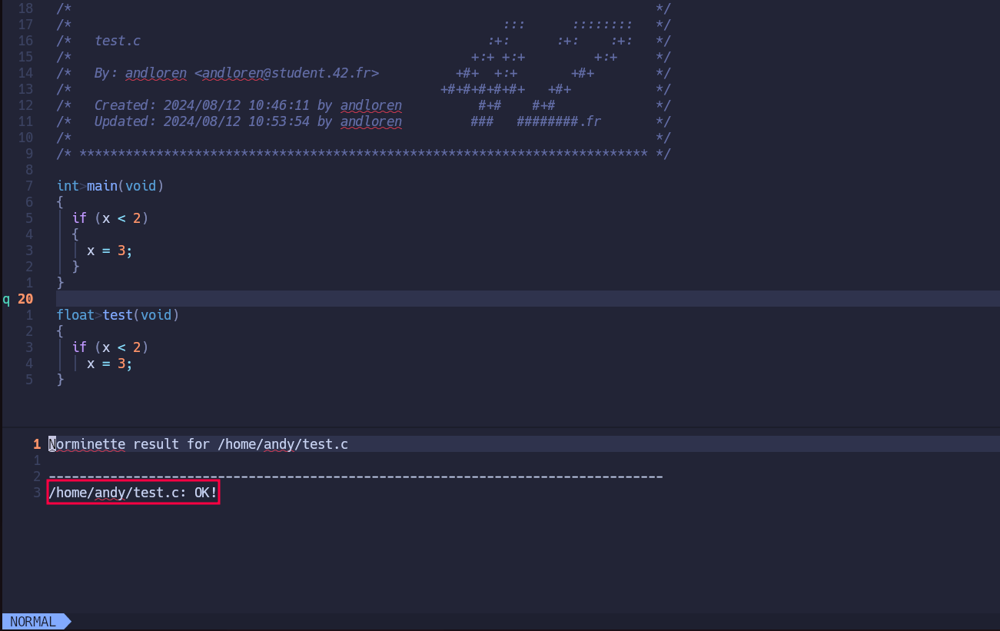
  
</div>

<br>
<br>

**Key `F5`:** Saves the active document / Equivalent to :w.

<br>

**Key `F6`:** Opens or closes the file explorer.

<div align="center">
  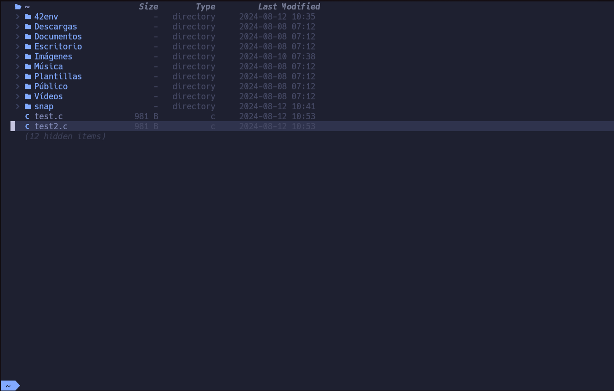
</div>

<br>

## Tabs in LazyVim
Each file opened will open in a different tab, allowing you to have multiple files open and switch between them easily. It also notifies you if you are trying to close a tab without saving changes.

<div align="center">
  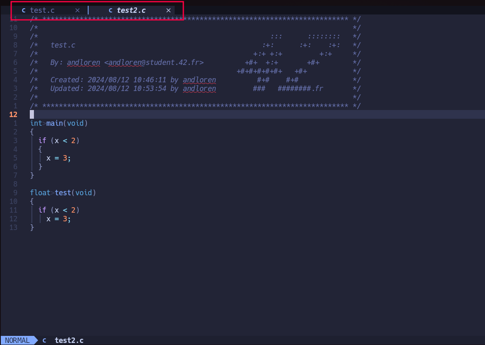
</div>

<br>

<div align="center">
  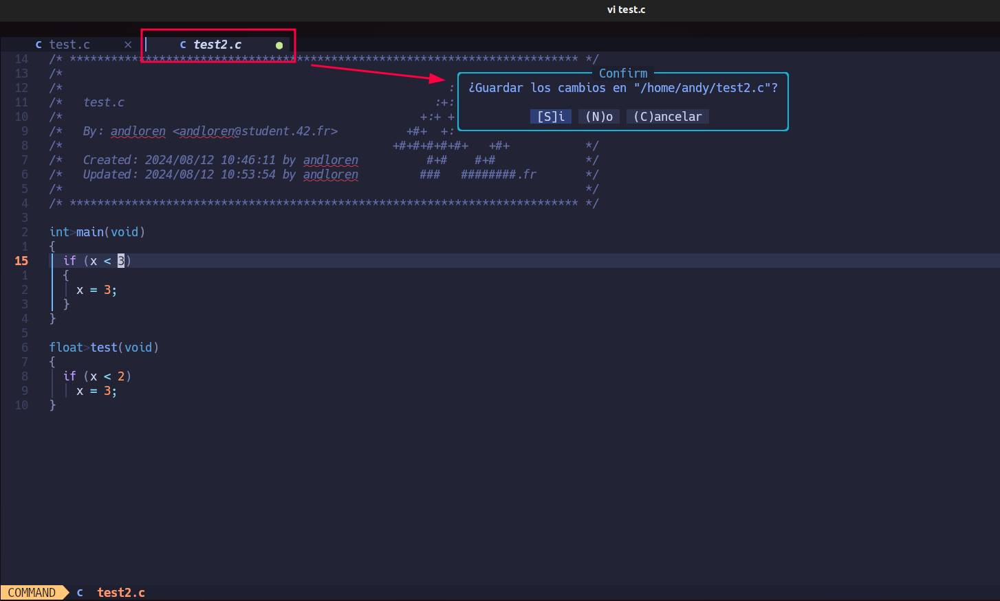
</div>

<br>

> **Note:** All other vim shortcuts work the same.

## Extras

# LSD (LSDeluxe)
The configuration includes the installation of LSD, which enhances terminal readability by taking advantage of the installed Nerd Fonts.

The alias ll is equivalent to:
```bash
/usr/bin/lsd -lha --group-dirs=first
```
<div align="center">
  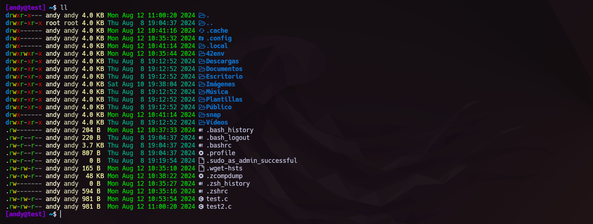
</div>

<br>

To view file and folder permissions in octal, use llo, which is an alias for:
```bash
/usr/bin/lsd -lha --group-dirs=first --permission octal
```
<div align="center">
  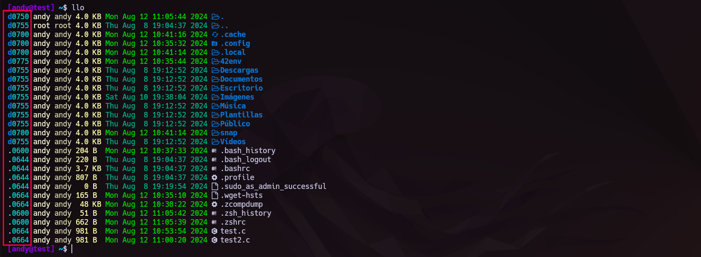
</div>

# LazyGit
LazyGit is ideal for those who prefer using the terminal but want a more comfortable and faster way to manage Git without typing all the commands manually. It is especially useful for developers working with large and complex repositories, as it simplifies visualizing changes and navigating between different sections of the repository.

> Give it a try—you've got nothing to lose!

<div align="center">
  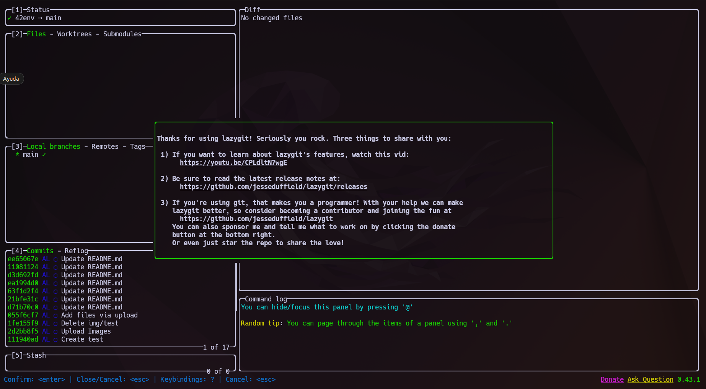
</div>

# Kitty-Terminal

<div align="center">
  
</div>

Kitty is an excellent choice if you're looking for a terminal emulator that combines speed, customization, and advanced functionality. It's ideal for users who want to make the most of their terminal environment. Kitty allows you to split the screen into multiple terminals within the same window, facilitating multitasking without needing multiple windows.

Kitty is an open-source project with active development, meaning it receives frequent updates and continuous improvements.

### Main Keyboard Shortcuts:

| Shortcut | Description |
| --- | --- |
| `Ctrl` + `Shift` + `Enter` | Open a new window in the current directory |
| `Ctrl` + `Shift` + `w` | Close the terminal or active window |
| `Ctrl` + `Shift` + `t` | Open a new tab in the current directory |
| `Ctrl` + `Shift` + `Alt` + `T` | Rename the tab in the current directory |
| `Ctrl` + `Shift` + `→` | Move to the tab on the right |
| `Ctrl` + `Shift` + `←` | Move to the tab on the left |
| `Ctrl` + `←` | Move to the neighboring window on the left |
| `Ctrl` + `→` | Move to the neighboring window on the right |
| `Ctrl` + `↑` | Move to the neighboring window above |
| `Ctrl` + `↓` | Move to the neighboring window below |
| `Ctrl` + `Shift` + `t` | Make the window wider |
| `Ctrl` + `Shift` + `l` | Make the window narrower |
| `Ctrl` + `Shift` + `i` | Make the window taller |
| `Ctrl` + `Shift` + `k` | Make the window shorter |
| `Shift` + `Alt` + `↑` | Scroll to the top of the scrollback buffer |
| `Shift` + `Alt` + `↓` | Scroll to the bottom of the scrollback buffer |
| `Shift` + `Alt` + `←` | Scroll one page up |
| `Shift` + `Alt` + `→` | Scroll one page down |
| `Ctrl` + `Shift` + `z` | "Zoom" Toggle between tiling or fullscreen layout |

<br>

### Example images:

<div align="center">
  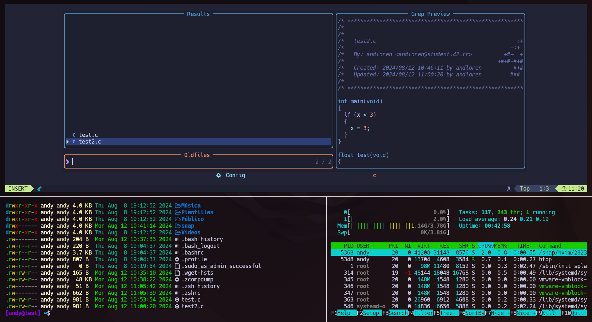
</div>

### Image and Graphic Support:
Kitty supports displaying images directly in the terminal, making it perfect for working with multimedia content. 

Here's an example of how to display an image in Kitty:
```bash
picture photo.jpg
```

<br>

`picture` is an aliased to:
```bash
kitty +kitten icat
```

### Tabs:
Kitty allows the use of tabs within a single window, making it easier to organize work across multiple terminal sessions. With tabs, you can keep several processes or files open simultaneously and switch between them quickly and efficiently, without the need to open new windows. This optimizes screen space and enhances productivity when working in command-line environments.

<div align="center">
  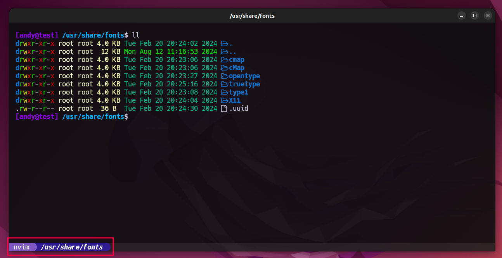
</div>

# In Progress...
Further improvements will be made to enhance the user experience and add more features to the script.

### Thank you!

[Return to Table of Contents](#table-of-contents)
